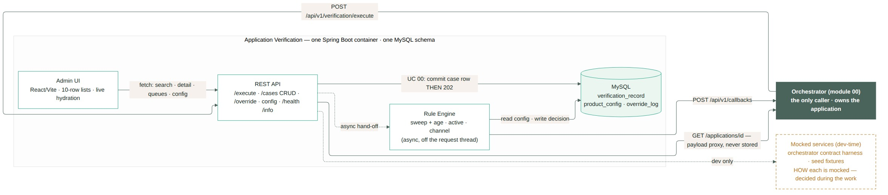

# Module 1 · Application Verification — AI implementation briefs

One self-contained brief per use case: context, contract, acceptance criteria, data changes and the mermaid source for sequence / entity / state diagrams. Generated from the spec — regenerate, don't hand-edit.

| UC | file | track · prerequisite |
|---|---|---|
| 00 | [uc-00-process-application.md](uc-00-process-application.md) | B · none (foundation) |
| 01 | [uc-01-search-cases.md](uc-01-search-cases.md) | A · after 00 — the rows it lists come from intake |
| 02 | [uc-02-review-case.md](uc-02-review-case.md) | B · after 00 + 06 — the engine decides against ProductConfig |
| 03 | [uc-03-view-applicant.md](uc-03-view-applicant.md) | D · screen shell from 02 |
| 04 | [uc-04-view-failure-patterns.md](uc-04-view-failure-patterns.md) | A · after 01 |
| 05 | [uc-05-override-case.md](uc-05-override-case.md) | B · after 02 is wired |
| 06 | [uc-06-create-product-version.md](uc-06-create-product-version.md) | C · none (independent) |
| 07 | [uc-07-view-version-history.md](uc-07-view-version-history.md) | C · after 06 |
| 08 (candidate) | [uc-08-employment-status-eligibility.md](uc-08-employment-status-eligibility.md) | B · after 01–07 |

Component/system diagram: 
