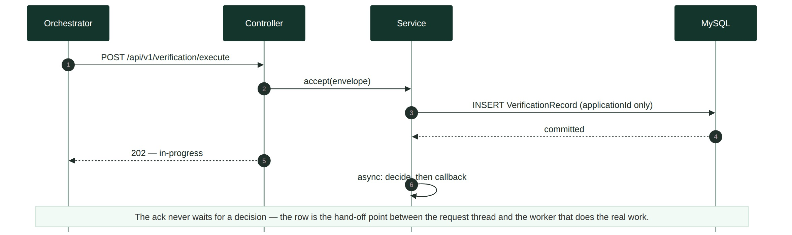
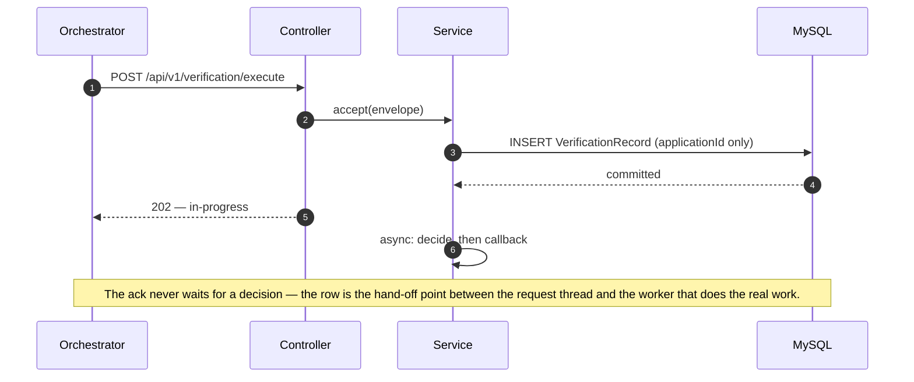
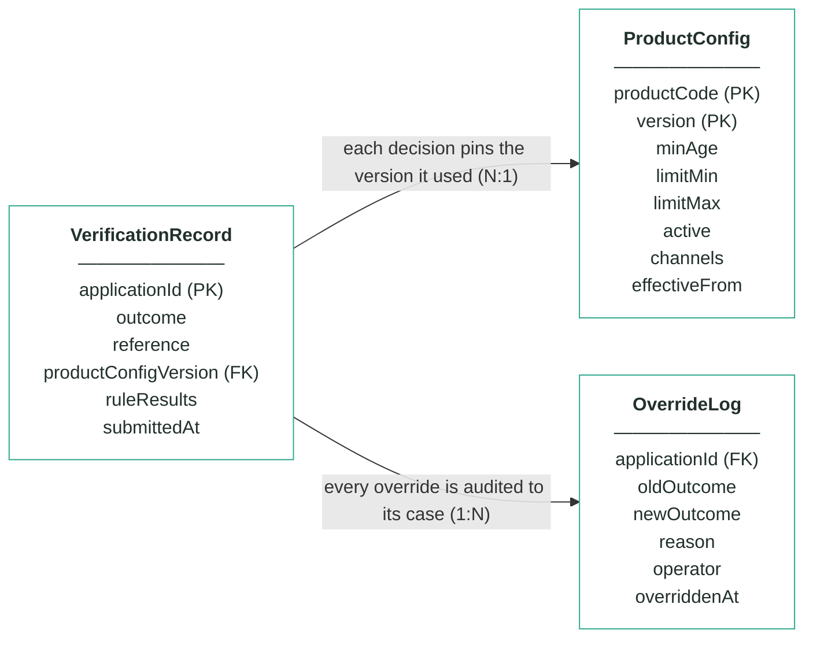
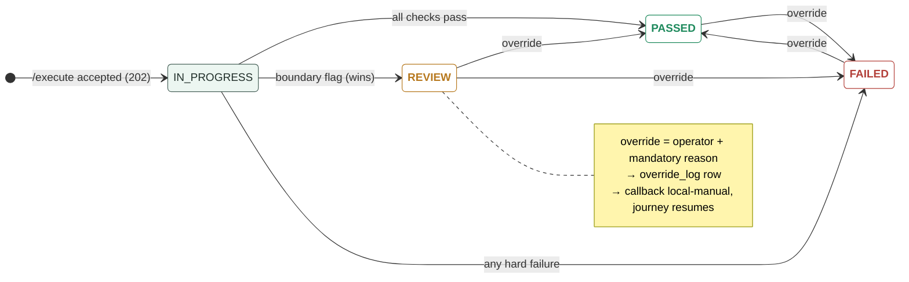

# Module 1 · Application Verification — UC 00 · Process Application

> AI implementation brief, generated from the v5 spec (`spec/.../use-cases/`). Source of truth is the spec; regenerate, don't hand-edit.

## Context

- Module: 1 · Application Verification · category Rule · domain `verification` · command `verify-application` · outcomes: PASSED, FAILED, REVIEW
- Use case: 00 · Process Application · track B · prerequisite: none (foundation) · build shape: API→DB · primary screen: — feeds every screen (row visible on the board)
- Data effect: one INSERT + 202 ack
- Platform rules (non-negotiable): the orchestrator is the only caller; the whole application arrives in the envelope (plus the v5 `outputs` block, Option A); steps are independent and re-orderable; the payload is NEVER stored — only `applicationId`; every module ships `GET /cases/{id}/applicant` proxying the orchestrator; big lists are empty by default and capped at 10 rows (≤10 hydration calls); ALL APIs are idempotent — same request twice, same result once; every endpoint appears in the service's OpenAPI 3.0 (Swagger) spec.

## Story

As the orchestrator I need every execute request acknowledged immediately and recorded durably, so the journey can advance and every other use case has a row to work on.

## Contract

```
POST /api/v1/verification/execute
{ applicationId, correlationId,
  command: "verify-application",
  application: { … }, outputs: { … } }
→ 202 Accepted
{ "status": "in-progress",
  "applicationId": "app-1234",
  "command": "verify-application" }
```

## Acceptance criteria

1. POST /api/v1/verification/execute with a valid envelope → 202 Accepted immediately — no rule or provider work happens on the request thread; body carries status "in-progress", the applicationId and the command.
2. Before the 202 is sent, exactly ONE VerificationRecord row exists, keyed by applicationId, in an in-progress state — a crash right after the ack loses nothing.  ⟵ **checkpoint — exact value**
3. Only the applicationId is persisted from the envelope — zero payload columns; the application object is handed to the off-thread worker, never stored.
4. Repeated /execute for the same applicationId → 202 again, still one row, no re-processing; once decided, the callback replays the stored outcome.
5. A malformed envelope (missing applicationId or command) → 400 with a JSON error body, and nothing is stored.
6. The off-thread decision starts only after the row is committed — everything in this module triggers from this row.
7. The new row is immediately visible to the search and case endpoints as an in-progress case.

## Expected data changes

- **INSERT one VerificationRecord row** keyed by applicationId — the ONLY applicant data ever stored.
- The row starts in-progress; every later use case UPDATEs or reads this same row.
- Idempotency = the unique key on applicationId; the trigger point = the commit.

## The Application entity — every field that arrives in the API

> The whole Application object is delivered in the envelope on every call. Fields this module reads are marked ●. The payload is NEVER stored — only `applicationId`.

| field | example | meaning |
|---|---|---|
| ● applicationId | app-1234 | journey key — every record this module stores is keyed by it |
| ● channel | MOBILE_APP | where the application was made: WEB · MOBILE_APP · BRANCH · AGGREGATOR — input to rule 3 (channel eligibility) |
| submittedAt | 2026-07-21T21:40:00Z | when the customer submitted — timestamps always UTC |
| ● applicant.fullName | Maria Nowak | sweep: non-blank; downstream modules match watchlists on it |
| ● applicant.dateOfBirth | 1996-04-11 | sweep: real past date · rule 1: age vs ProductConfig.minAge |
| ● applicant.email / mobile | maria@…  +4477… | sweep: format check (email-shaped, E.164-ish) — contact for agreement |
| applicant.nationality | PL | ISO 3166-1 alpha-2 — module 3 cross-checks the identity document |
| ● applicant.countryOfResidence | GB | sweep: valid ISO code — module 4 uses it for jurisdiction risk |
| applicant.taxResidencies | ["GB"] | at least one — module 2's tax-residency policy reads it |
| applicant.currentAddress | 42 Hanbury St, E1 5JP | sweep: present and complete — module 8 posts the card here |
| identityDocument.* | PASSPORT · ZS1234567 | type, id, issuingCountry, expiryDate — module 3 sends it to the identity provider; sweep checks presence only |
| employment.status / employerName / months | PERMANENT · 11 | module 5's affordability inputs — sweep checks presence |
| finances.annualIncome | 34000 | integer GBP per year — module 5 decides the limit from it |
| finances.monthlyHousingCost / existingCreditCommitments | 1000 · 180 | monthly outgoings — module 5's DTI calculation |
| ● product.productCode | CREDIT_CARD_REWARDS | must exist in ProductConfig · rule 2: product still active · rule 3: sold via this channel |
| ● product.requestedCreditLimit | 3000 | sweep: inside the product's limitMin–limitMax · exactly at max → REVIEW |
| delivery.useCurrentAddress / address | true · null | module 8 posts the card — address only when useCurrentAddress=false |
| ● consents.termsAccepted | true | sweep: false → FAILED (VER_TERMS_NOT_ACCEPTED) — module 6 re-reads it as its consent gate |
| consents.paperless / marketingConsent | true · false | statement + marketing preferences — candidate rules elsewhere |
| outputs  (v5 · Option A) | { } | step results accumulated by the orchestrator as the saga advances — approvedLimit/APR after step 5, agreementId after 6, accountId after 7. EMPTY at step 1: this module never reads it |

_Ground rules: unknown fields are ignored on the way in and never emitted on the way out · countries ISO alpha-2 uppercase · dates YYYY-MM-DD · money = integer GBP · optional = null, never "" or 0._

## Diagrams

> Rendered images first (for PDF/preview); the mermaid source is collapsed underneath for machine consumption.

### Sequence — this use case



<details><summary>mermaid source</summary>



</details>

### Entity model (suggested — the shape to beat)


**VerificationRecord — one row per applicationId (unique)**

| field | type | key | meaning |
|---|---|---|---|
| applicationId | string | PK | the journey key from the envelope — one row per application, and the ONLY applicant-related column |
| outcome | enum |  | the final answer: PASSED, FAILED or REVIEW — changed only through the Override endpoint |
| reference | string |  | human-facing case reference shown on every screen, e.g. ver-000123 |
| productConfigVersion | int | FK | the ProductConfig version this decision used — pinned forever for explainability |
| ruleResults | JSON |  | embedded results of the four checks — wellFormedness with per-field reasons, then age, productActive and channel, each with passed + reason code |
| submittedAt | timestamp |  | when the orchestrator submitted the case |

**ProductConfig — insert-only, versioned product terms; the current version is the highest per product**

| field | type | key | meaning |
|---|---|---|---|
| productCode | string | PK | which product the terms govern: CREDIT_CARD_STANDARD, _REWARDS or _STUDENT — key together with version |
| version | int | PK | one new row per change — rows are inserted, never updated; current = the highest version per product |
| minAge | int |  | the age rule's threshold — below it FAILED, exactly at it REVIEW (seeded 18 for all three products) |
| limitMin | int |  | the smallest requestable credit limit in GBP — the sweep fails requests below it |
| limitMax | int |  | the largest requestable credit limit in GBP — above it fails the sweep, exactly at it goes to REVIEW |
| active | boolean |  | the product-active rule — false on the current version fails every new application (VER_PRODUCT_INACTIVE) |
| channels | string[] |  | the channel rule — where the product may be sold, e.g. [WEB, MOBILE_APP]; any other channel fails (VER_CHANNEL_NOT_ELIGIBLE) |
| effectiveFrom | timestamp |  | when this version became the current one |

**OverrideLog — audit trail; one row per manual override, none ever deleted**

| field | type | key | meaning |
|---|---|---|---|
| applicationId | string | FK | the case that was overridden |
| oldOutcome | enum |  | the outcome before the override |
| newOutcome | enum |  | the outcome after the override |
| reason | string |  | the mandatory justification typed by the operator |
| operator | string |  | who performed the override |
| overriddenAt | timestamp |  | when it happened |

Relationships: VerificationRecord N:1 ProductConfig — each decision pins the version it used · VerificationRecord 1:N OverrideLog — every override is audited to its case

<details><summary>mermaid source (generated from the spec tables)</summary>



</details>

### State transitions — the case record


<details><summary>mermaid source</summary>



</details>

## Out of scope

Deciding anything (that is the engine use case, which runs off-thread AFTER this row exists); the callback content.

## Build notes

Partially implemented by the template — the 202-then-callback controller is given. Your work: the durable VerificationRecord row, idempotency by applicationId, and the async hand-off. EVERY other use case depends on this one: no row, no review, no queue, no override, no report.

## Tests

Slice test: 202 shape + row inserted before the ack returns; repeated /execute → one row; malformed envelope → 400 and nothing stored.

## Sequence caption

The ack never waits for a decision — the row is the hand-off point between the request thread and the worker that does the real work.

## Definition of done

All acceptance criteria verified against the running app · `./mvnw test` green · teammate-reviewed PR merged to main · fresh clone builds green · endpoint idempotent + present in the OpenAPI 3.0 (Swagger) spec · demoable from the UI.
