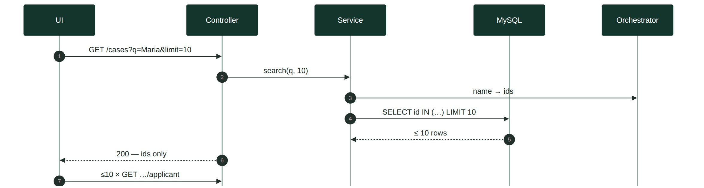
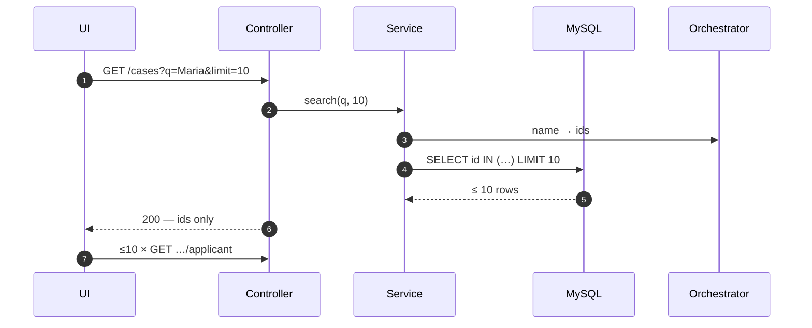
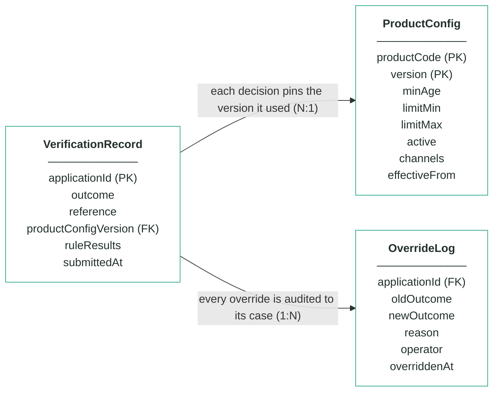
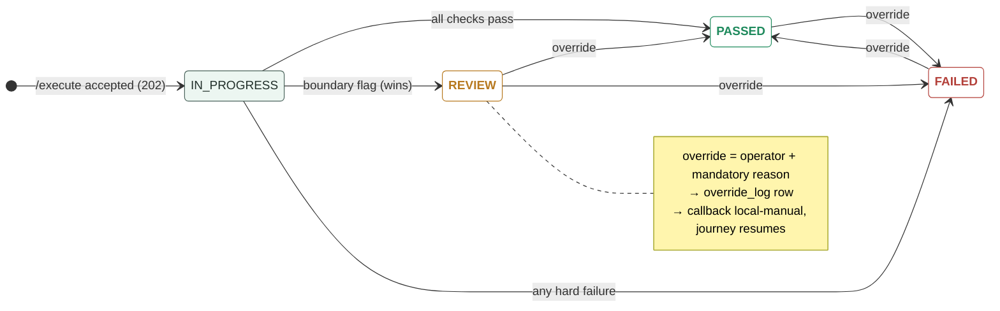

# Module 1 · Application Verification — UC 01 · Search Cases

> AI implementation brief, generated from the v5 spec (`spec/.../use-cases/`). Source of truth is the spec; regenerate, don't hand-edit.

## Context

- Module: 1 · Application Verification · category Rule · domain `verification` · command `verify-application` · outcomes: PASSED, FAILED, REVIEW
- Use case: 01 · Search Cases · track A · prerequisite: after 00 — the rows it lists come from intake · build shape: DB→API→FE · primary screen: Verification Board
- Data effect: read-only · zero payload stored
- Platform rules (non-negotiable): the orchestrator is the only caller; the whole application arrives in the envelope (plus the v5 `outputs` block, Option A); steps are independent and re-orderable; the payload is NEVER stored — only `applicationId`; every module ships `GET /cases/{id}/applicant` proxying the orchestrator; big lists are empty by default and capped at 10 rows (≤10 hydration calls); ALL APIs are idempotent — same request twice, same result once; every endpoint appears in the service's OpenAPI 3.0 (Swagger) spec.

## Story

As a bank employee I want to find a verification case by application id or applicant name — without this module ever storing applicant data.

## Contract

```
GET /cases?q={id-or-name}&limit=10 →
[{"applicationId":"app-1234",
  "submittedAt":"2026-07-21T21:40:00Z",
  "outcome":"PASSED","reasonCount":1}, …]
// applicantName is NOT in the row —
// the UI hydrates ≤10 rows live
```

## Acceptance criteria

1. The Verification Board is EMPTY by default — no query, no rows fetched, a hint invites a search.
2. GET /cases?q=… → 200 + at most 10 matches, newest first; an 11th match means the response flags "more — refine your search".
3. Search by applicationId works entirely from the local table; search by name resolves ids through the orchestrator first — nothing about the applicant is ever persisted.
4. The applicant-name column hydrates live via the module's application-fetch GET — at most 10 calls per render, cached per page view.
5. Searching "Maria" shows her case with outcome = "PASSED".  ⟵ **checkpoint — exact value**
6. No matches → [] and HTTP 200 (never a 500); orchestrator down → rows render with ids, names show a retryable "—".

## Expected data changes

- **No rows change, and no applicant data ever lands in MySQL.** The schema has no name column to search.
- Name → ids via the orchestrator; ids → local records; names on screen via ≤10 live hydration calls.
- Empty by default + LIMIT 10 is what keeps the hydration bill bounded — never 100s of requests.

## Diagrams

> Rendered images first (for PDF/preview); the mermaid source is collapsed underneath for machine consumption.

### Sequence — this use case



<details><summary>mermaid source</summary>



</details>

### Entity model (suggested — the shape to beat)


**VerificationRecord — one row per applicationId (unique)**

| field | type | key | meaning |
|---|---|---|---|
| applicationId | string | PK | the journey key from the envelope — one row per application, and the ONLY applicant-related column |
| outcome | enum |  | the final answer: PASSED, FAILED or REVIEW — changed only through the Override endpoint |
| reference | string |  | human-facing case reference shown on every screen, e.g. ver-000123 |
| productConfigVersion | int | FK | the ProductConfig version this decision used — pinned forever for explainability |
| ruleResults | JSON |  | embedded results of the four checks — wellFormedness with per-field reasons, then age, productActive and channel, each with passed + reason code |
| submittedAt | timestamp |  | when the orchestrator submitted the case |

**ProductConfig — insert-only, versioned product terms; the current version is the highest per product**

| field | type | key | meaning |
|---|---|---|---|
| productCode | string | PK | which product the terms govern: CREDIT_CARD_STANDARD, _REWARDS or _STUDENT — key together with version |
| version | int | PK | one new row per change — rows are inserted, never updated; current = the highest version per product |
| minAge | int |  | the age rule's threshold — below it FAILED, exactly at it REVIEW (seeded 18 for all three products) |
| limitMin | int |  | the smallest requestable credit limit in GBP — the sweep fails requests below it |
| limitMax | int |  | the largest requestable credit limit in GBP — above it fails the sweep, exactly at it goes to REVIEW |
| active | boolean |  | the product-active rule — false on the current version fails every new application (VER_PRODUCT_INACTIVE) |
| channels | string[] |  | the channel rule — where the product may be sold, e.g. [WEB, MOBILE_APP]; any other channel fails (VER_CHANNEL_NOT_ELIGIBLE) |
| effectiveFrom | timestamp |  | when this version became the current one |

**OverrideLog — audit trail; one row per manual override, none ever deleted**

| field | type | key | meaning |
|---|---|---|---|
| applicationId | string | FK | the case that was overridden |
| oldOutcome | enum |  | the outcome before the override |
| newOutcome | enum |  | the outcome after the override |
| reason | string |  | the mandatory justification typed by the operator |
| operator | string |  | who performed the override |
| overriddenAt | timestamp |  | when it happened |

Relationships: VerificationRecord N:1 ProductConfig — each decision pins the version it used · VerificationRecord 1:N OverrideLog — every override is audited to its case

<details><summary>mermaid source (generated from the spec tables)</summary>



</details>

### State transitions — the case record


<details><summary>mermaid source</summary>



</details>

## Out of scope

Pagination beyond the 10-row cap (refine the search instead); free browsing of the whole book.

## Build notes

v5 payload rule: no applicant columns exist, so name search resolves ids via the orchestrator (GET /applications?name= — a v5 contract addition) and id search hits the local table. The board hydrates the applicant-name column live, one GET per visible row, 10 max.

## Tests

Web-slice test: empty default, 10-row cap, id search local, name search via mocked orchestrator client, empty [] case.

## Definition of done

All acceptance criteria verified against the running app · `./mvnw test` green · teammate-reviewed PR merged to main · fresh clone builds green · endpoint idempotent + present in the OpenAPI 3.0 (Swagger) spec · demoable from the UI.
