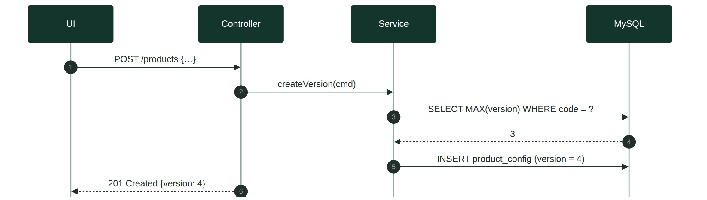
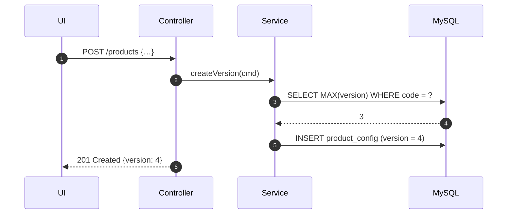
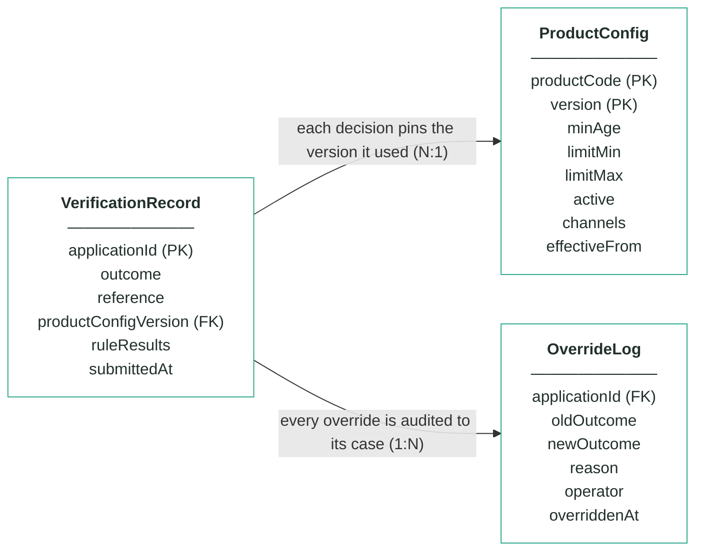
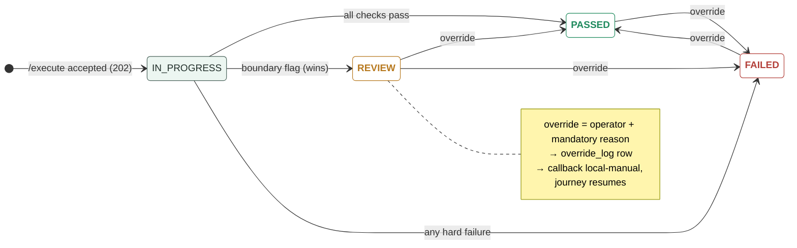
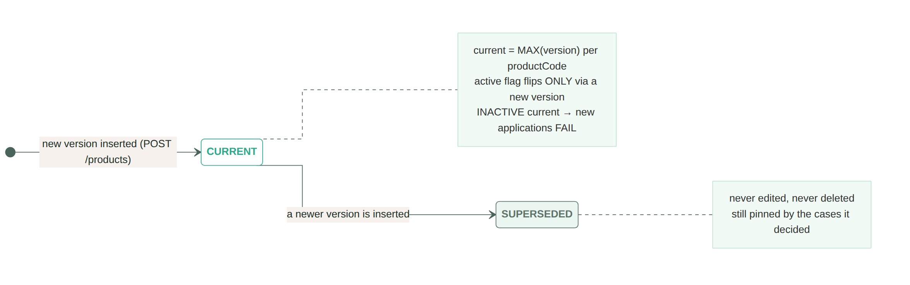
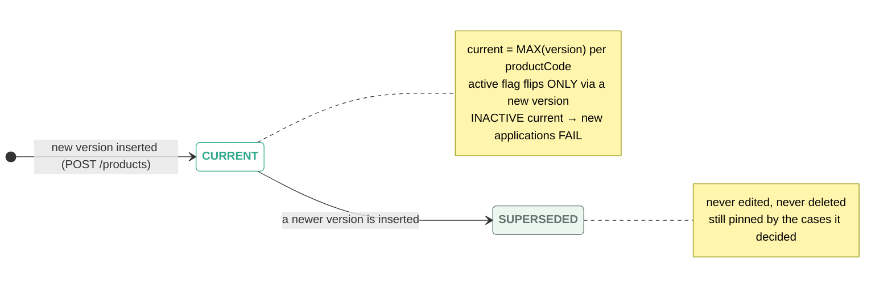

# Module 1 · Application Verification — UC 06 · Create Product Version

> AI implementation brief, generated from the v5 spec (`spec/.../use-cases/`). Source of truth is the spec; regenerate, don't hand-edit.

## Context

- Module: 1 · Application Verification · category Rule · domain `verification` · command `verify-application` · outcomes: PASSED, FAILED, REVIEW
- Use case: 06 · Create Product Version · track C · prerequisite: none (independent) · build shape: DB-write→API→FE · primary screen: Product Configuration
- Data effect: insert-only
- Platform rules (non-negotiable): the orchestrator is the only caller; the whole application arrives in the envelope (plus the v5 `outputs` block, Option A); steps are independent and re-orderable; the payload is NEVER stored — only `applicationId`; every module ships `GET /cases/{id}/applicant` proxying the orchestrator; big lists are empty by default and capped at 10 rows (≤10 hydration calls); ALL APIs are idempotent — same request twice, same result once; every endpoint appears in the service's OpenAPI 3.0 (Swagger) spec.

## Story

As a product manager I want to add a product, or change its rules, without a deploy — policy ships as data.

## Contract

```
POST /products
{"productCode":"CREDIT_CARD_REWARDS",
 "minAge":18,"limitMin":500,
 "limitMax":10000,"active":true,
 "channels":["WEB","MOBILE_APP","BRANCH"]}
→ 201 + {version: 4}
```

## Acceptance criteria

1. POST /products {productCode, minAge, limitMin, limitMax, active, channels[]} → 201; a NEW version row is inserted — never an update.
2. Version numbers increment per productCode, starting at the seeded versions.
3. Seed data: the 3 catalogue products exist on first boot with the api-contract thresholds.  ⟵ **checkpoint — exact value**
4. Invalid payload (limitMin ≥ limitMax, empty channels, unknown channel) → 400 with field-level errors.
5. The next /execute for that product decides with the new version; cases decided earlier still show the version they used.
6. Setting active=false makes the very next /execute for that product FAIL with VER_PRODUCT_INACTIVE — demo-able live.

## Expected data changes

- **INSERT product_config** row with version = MAX + 1.
- **Never UPDATE, never DELETE** — history is the audit trail.
- Existing verification_record rows are untouched — their pinned productConfigVersion keeps old decisions explainable.

## Diagrams

> Rendered images first (for PDF/preview); the mermaid source is collapsed underneath for machine consumption.

### Sequence — this use case



<details><summary>mermaid source</summary>



</details>

### Entity model (suggested — the shape to beat)


**VerificationRecord — one row per applicationId (unique)**

| field | type | key | meaning |
|---|---|---|---|
| applicationId | string | PK | the journey key from the envelope — one row per application, and the ONLY applicant-related column |
| outcome | enum |  | the final answer: PASSED, FAILED or REVIEW — changed only through the Override endpoint |
| reference | string |  | human-facing case reference shown on every screen, e.g. ver-000123 |
| productConfigVersion | int | FK | the ProductConfig version this decision used — pinned forever for explainability |
| ruleResults | JSON |  | embedded results of the four checks — wellFormedness with per-field reasons, then age, productActive and channel, each with passed + reason code |
| submittedAt | timestamp |  | when the orchestrator submitted the case |

**ProductConfig — insert-only, versioned product terms; the current version is the highest per product**

| field | type | key | meaning |
|---|---|---|---|
| productCode | string | PK | which product the terms govern: CREDIT_CARD_STANDARD, _REWARDS or _STUDENT — key together with version |
| version | int | PK | one new row per change — rows are inserted, never updated; current = the highest version per product |
| minAge | int |  | the age rule's threshold — below it FAILED, exactly at it REVIEW (seeded 18 for all three products) |
| limitMin | int |  | the smallest requestable credit limit in GBP — the sweep fails requests below it |
| limitMax | int |  | the largest requestable credit limit in GBP — above it fails the sweep, exactly at it goes to REVIEW |
| active | boolean |  | the product-active rule — false on the current version fails every new application (VER_PRODUCT_INACTIVE) |
| channels | string[] |  | the channel rule — where the product may be sold, e.g. [WEB, MOBILE_APP]; any other channel fails (VER_CHANNEL_NOT_ELIGIBLE) |
| effectiveFrom | timestamp |  | when this version became the current one |

**OverrideLog — audit trail; one row per manual override, none ever deleted**

| field | type | key | meaning |
|---|---|---|---|
| applicationId | string | FK | the case that was overridden |
| oldOutcome | enum |  | the outcome before the override |
| newOutcome | enum |  | the outcome after the override |
| reason | string |  | the mandatory justification typed by the operator |
| operator | string |  | who performed the override |
| overriddenAt | timestamp |  | when it happened |

Relationships: VerificationRecord N:1 ProductConfig — each decision pins the version it used · VerificationRecord 1:N OverrideLog — every override is audited to its case

<details><summary>mermaid source (generated from the spec tables)</summary>



</details>

### State transitions — the case record


<details><summary>mermaid source</summary>



</details>

### State transitions — the versioned configuration



<details><summary>mermaid source</summary>



</details>

## Out of scope

Deleting or editing an existing version (insert-only); per-channel limit ranges.

## Build notes

current = MAX(version) per productCode — no is_current flag to keep in sync. Validation: limitMin < limitMax, minAge ≥ 18, channels non-empty, known channel values only.

## Tests

Repository test: version increments per code; validation 400s; engine picks up the new current version on the next /execute.

## Definition of done

All acceptance criteria verified against the running app · `./mvnw test` green · teammate-reviewed PR merged to main · fresh clone builds green · endpoint idempotent + present in the OpenAPI 3.0 (Swagger) spec · demoable from the UI.
